# <h1 align="center">README -  Dinamic Adventure </h1>
__
Proyecto Final: Frontend - Full Stack Developer Bootcamp en GeeksHubs Academy 
__

   

      
   
    

Frontend de Dinamic Adventure, por Marta Guillem Olmos.
 

## 📋 Contenidos del Readme

   

   
Apartados

   - <a href="#🚀-descripción"><h4>🚀 Descripción</h4></a>
   - <a href="#🎯-objetivo"><h4>🎯 Objetivo</h4></a>
   - <a href="#🛠️-tecnologías-utilizadas"><h4>🛠️ Tecnologías utilizadas</h4></a>
   - <a href="#📉-diagrama-de-la-base-de-datos"><h4>📉 Diagrama de la base de datos</h4></a>
   - <a href="#💡-funcionalidades"><h4>💡 Funcionalidades</h4></a>
   - <a href="#⚙️-instrucciones-de-uso"><h4>⚙️ Instrucciones de uso</h4></a>
   - <a href="#⚙️-media-query"><h4>📱 Media Query</h4></a>
   - <a href="#📅-organización"><h4>📅 Organización</h4></a>
   - <a href="#👏-agradecimientos"><h4>👏 Agradecimientos</h4></a>
   - <a href="#🌟-mejoras"><h4>🌟 Mejoras</h4></a>
   - <a href="#📧-contacto"><h4>📧 Contacto</h4></a>

   

## 🚀 Descripción 
¡Bienvenido a Dinamic Adventure! En este repositorio desarrollamos el frontend para una empresa de deportes de aventura, creando una plataforma atractiva e intuitiva para los usuarios. Si quieres saber más a cerca de este proyecto, sigue en este repositorio.

## 🎯 Objetivo

En este proyecto, nos proponemos hacer que la plataforma sea tan atractiva como las experiencias que ofrece. El objetivo principal es permitir a los usuarios explorar y reservar actividades de manera sencilla y eficaz, todo ello enmarcado en un diseño coherente con los colores corporativos.

#### Detalles del Objetivo 

1. **Experiencia Accesible**: Buscamos proporcionar una experiencia en la plataforma que sea atractiva y accesible. Queremos que los usuarios se sientan cómodos al explorar las opciones y reservar actividades sin complicaciones.

2. **Interfaz Intuitiva**: La interfaz se diseñará de manera intuitiva, facilitando la exploración y reserva de actividades. Queremos que los usuarios encuentren lo que buscan de manera rápida y sencilla.

3. **Automatización de Reservas**: La gestión de reservas se automatizará para que los usuarios puedan realizar acciones como visualizar, ajustar y cancelar reservas de manera eficiente.

4. **Acceso Eficiente para el Administrador**: El administrador contará con un acceso eficiente a toda la información relevante, incluyendo datos de usuarios registrados y detalles específicos de reservas. Esto facilitará la gestión interna del sistema.

5. **Integración Transparente con el Backend**: Aunque la integración con el backend será esencial, buscamos que sea transparente para el usuario. Nos aseguraremos de que cada reserva se procese de forma segura y sin complicaciones.

---

## 🛠️ Tecnologias utilizadas:
Las tecnologías que hemos utilizado para desarrollar el proyecto son las siguientes:

 

---

## 📉 Diagrama de la base de datos

   

      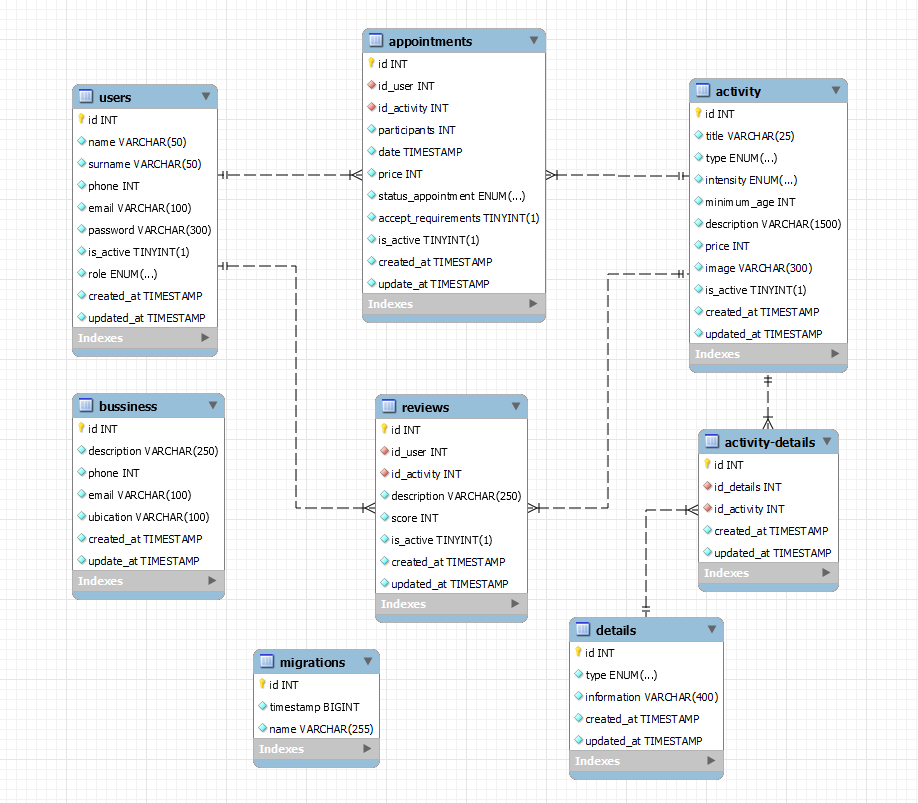
   
    
   

    <em>Diseño de la base de datos</em>
    
  

>[!IMPORTANT]
>Si quieres información más detallada, accede al repositorio: https://github.com/martaguillemolmos/backend-dinamic-adventure/

---

## 💡 Funcionalidades
A continuación desarrollaremos la funcionalidad del fronted.

#### Registro y Autenticación de Usuarios
Permite a los usuarios registrarse e iniciar sesión de manera sencilla.

   

      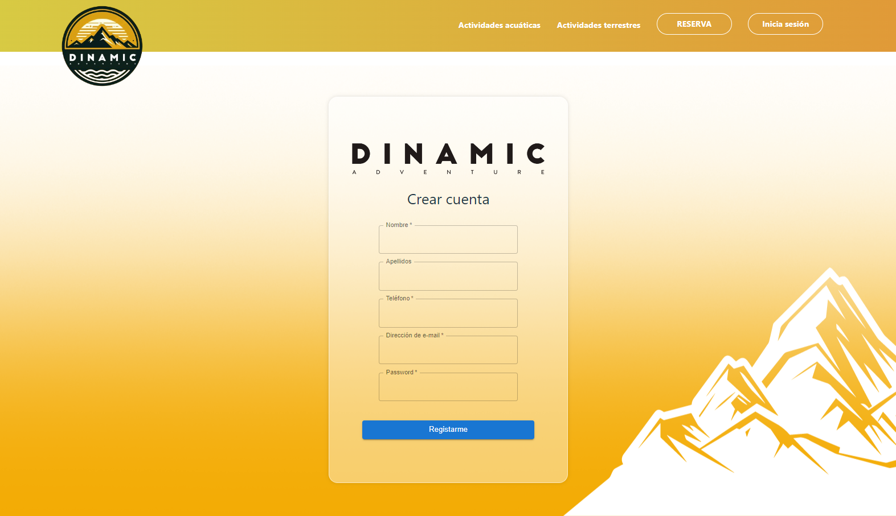
   
    
   

   <em>Registro</em>
    
  

   

      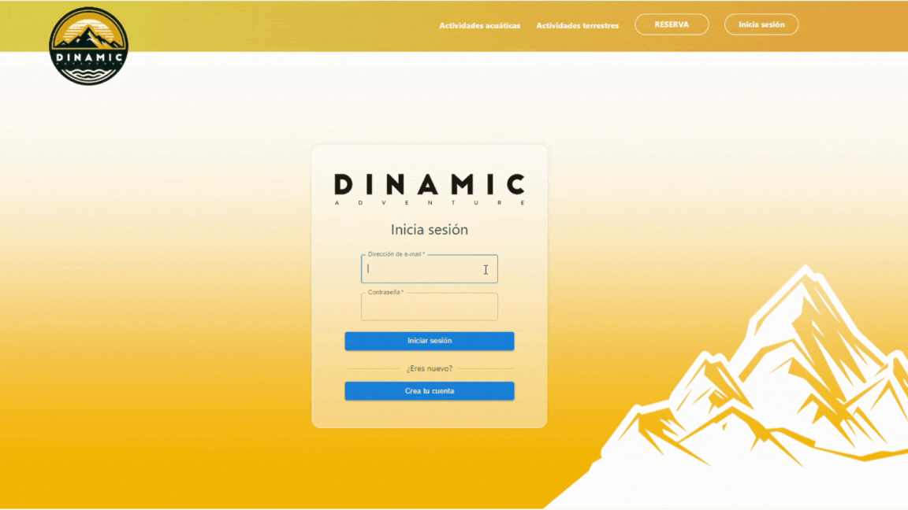
   
    
   

   <em> Inicio de sesión </em>
    
  

#### Perfil de Usuario
Cada usuario puede visualizar y editar sus datos personales para una experiencia más personalizada. Incluye una sección de seguridad para cambiar la contraseña y desactivar la cuenta.

   

      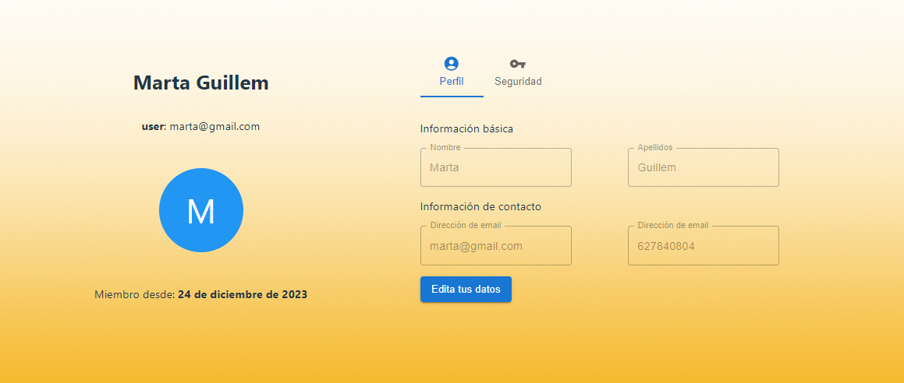
   
    
   

   <em> Datos generales </em>
    
  
     

      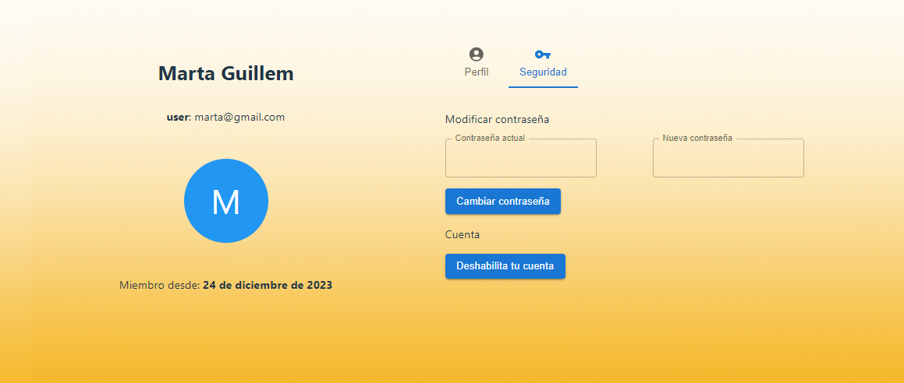
   
    
   

   <em> Seguridad: Cambio de contraseña y desactivar cuenta </em>
    
 

#### Historial de Citas
Los clientes tendrán acceso a una vista que mostrará su historial de citas. 
Implementamos filtrado para facilitar la exploración del historial, permitiendo buscar por actividad o estado de la cita.

   

      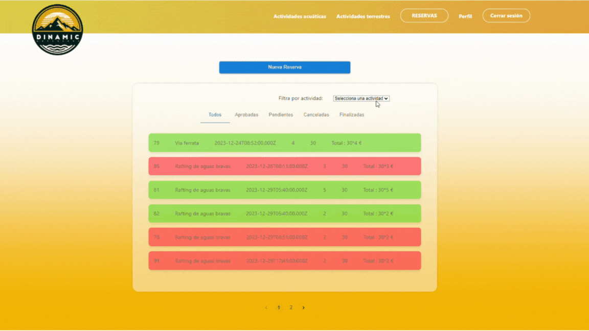
   
    

#### Filtrado de actividades
Los usuarios podrán visualizar todas las actividades en la pestaña de reservas o bien, filtrar la búsqueda en actividades acuáticas y terrestres.

#### Agendar Nueva Cita
Implementaremos una interfaz intuitiva que permitirá a los clientes agendar nuevas citas de manera sencilla y rápida. 
Para ello, el usuario podrá contar con dos vistas:
- **Vista Previa a la Reserva**: Antes de realizar la reserva, los usuarios tienen acceso a una vista previa que les permite filtrar la disponibilidad por fecha. Esto les brinda la oportunidad de explorar las fechas disponibles y seleccionar la que mejor se adapte a sus preferencias.

- **Información Detallada y Reserva**: Accedemos a la información detallada de la actividad y realizamos la reserva de la misma. 

>[!NOTE]
>Para garantizar una experiencia óptima, hemos establecido algunas pautas importantes:
> **1. Ratio de Participantes**: *Hemos fijado un límite de 12 participantes por fecha y actividad, asegurando que cada experiencia sea manejable y personalizada.*
> **2. Grupo Mínimo**: *Para cada actividad y turno, hemos establecido un grupo mínimo de 4 participantes. Esto garantiza que la actividad tenga la participación necesaria para llevarse a cabo.*
>**3. Flexibilidad en el Grupo Mínimo**: *En el caso de que una actividad alcance el grupo mínimo necesario antes de la fecha programada, no será obligatorio que el grupo sea superior a 4 participantes. Esto permite adaptarse a las dinámicas y demandas de cada actividad en particular.*

#### Modificar una Cita
El usuario podrá modificar una cita, siempre que esta esté en estado pendiente. En este momento, volverá a realizar las comprobaciones para validar si cuenta con disponibilidad.

#### Panel de administración
El administrador contará con una vista que proporcionará acceso al perfil del usuario: información y citas agendadas.

   

      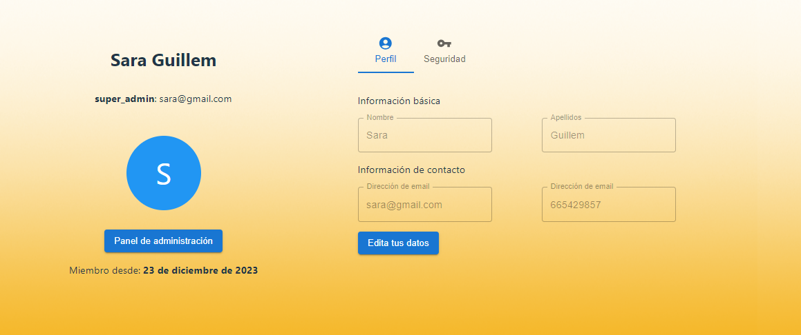
   
    

Acceso a todos los usuarios y las citas registradas en la aplicación

   

      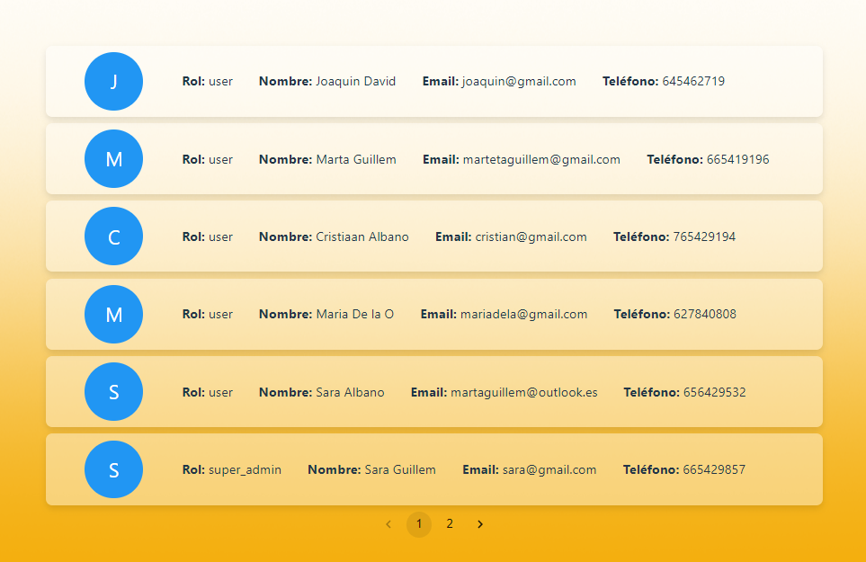
   
    

### Implementación de validaciones y manejo de errores.

Estas funcionalidades no solo proporcionan una experiencia fluida para los usuarios, sino que también se ha prestado especial atención a la implementación de validaciones y manejo de errores para garantizar la integridad y seguridad del sistema.

   

      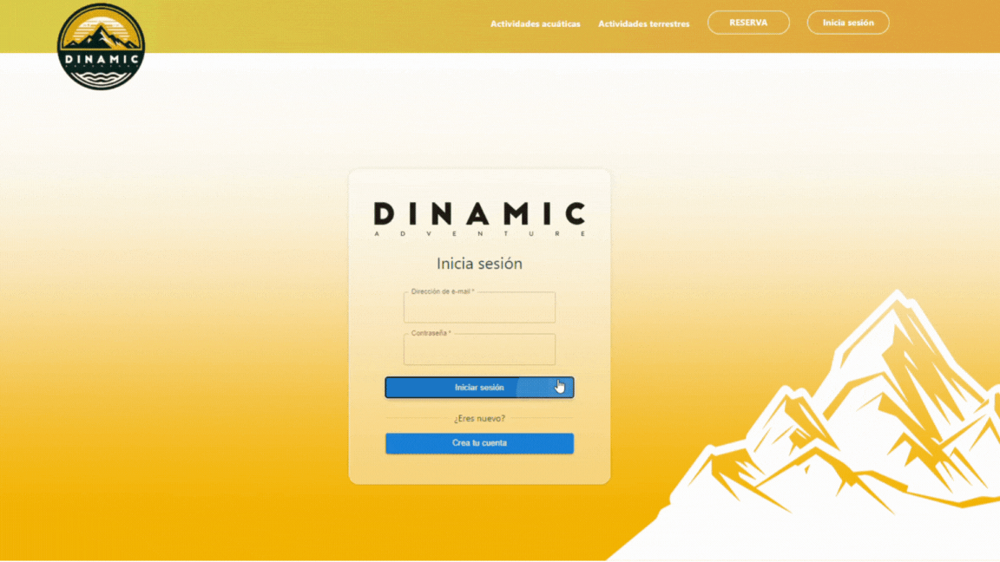
   
    
   

    <em>Manejo de errores.</em>
    
  

---
## ⚙️ Instrucciones de uso

 Instrucciones

1. Clona este repositorio en tu máquina local usando el siguiente comando: `git clone [URL del repositorio]`.
2. A continuación instala todas las dependencias con el comando ` $ npm install `
3. Por último, ponemos el marcha el proyecto con ` $ npm run dev `

---

## 📱 Media Query
Este proyecto utiliza consultas de medios para garantizar que la página web se vea y funcione correctamente en diferentes tamaños de pantalla.
Este es el resultado desde un dispositivo móvil.

   

      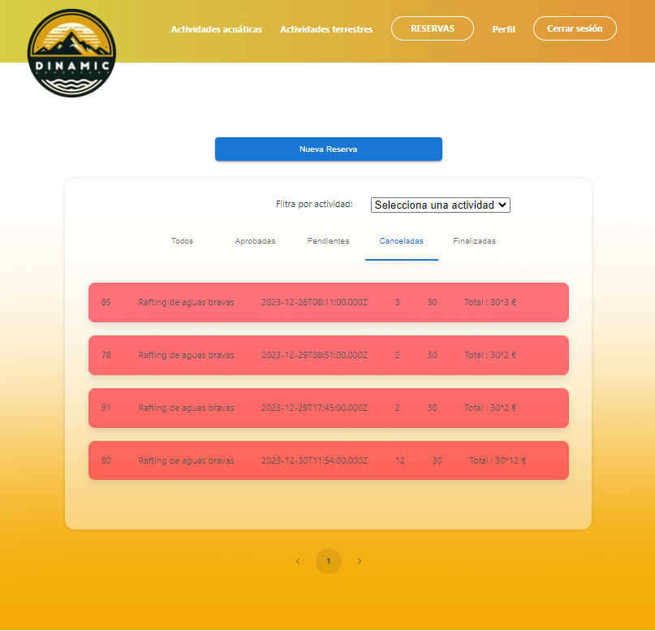
   
    

---

## 📅 Organización
Para llevar a cabo este proyecto he utilizado las siguientes herramientas:
- <strong>Trello 🖇️</strong>

    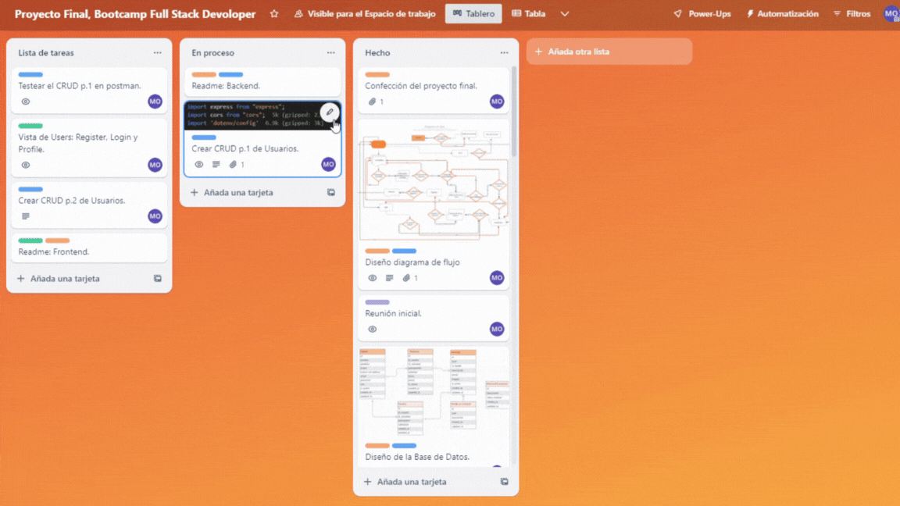
   

   <em>Disposición del tablón,</em>
      <a href = "https://trello.com/invite/b/2sgYNf7n/ATTI9b0d30dde3135781a2a8f2e3c74126694B79607A/proyecto-final-bootcamp-full-stack-devoloper">accede a él en Trello.</a>

 
- <strong>Ramas en el repositorio</strong> 🪴

- La estructura del respositorio está compuesta por cinco ramas:
    - <strong>Master</strong>: Rama principal del proyecto.
    - <strong>Dev</strong>: Rama en la que se combinan los trabajos de las otras ramas y se testean antes de pasarse a producción.

    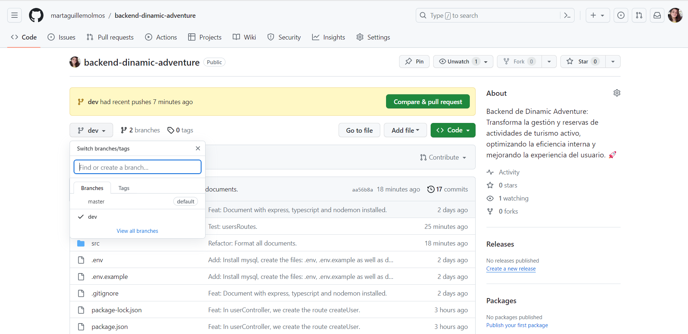
   

   <em>Repositorio de GitHub</em>

## 👏 Agradecimientos
Este proyecto es el reflejo de todos los conocimientos que hemos adquirido hasta la fecha en el BootCamp FullStack Developer.

## 🌟 Mejoras

Para mejorar la eficiencia y flexibilidad en la gestión de actividades, proponemos la implementación de una tabla que permita al administrador establecer y modificar la disponibilidad. Esta funcionalidad proporcionará un mayor control sobre la programación de actividades y adaptabilidad.

## 📧 Contacto
Contacta conmigo por correo electrónico [martaguillem@outlook.es](mailto:martaguillem@outlook.es). Además, puedes seguirme en:
  
 - [GitHub]((https://github.com/martaguillemolmos))   | [LinkedIn](https://www.linkedin.com/in/marta-guillem-olmos-b26b9b293/)